# POC: GitHub Actions Orchestrated Fabric Deployment + Post-Deployment Schedule Rehydration

A local proof of concept that uses **GitHub as the control plane** to:

1. Trigger a **Microsoft Fabric Deployment Pipeline** promotion (DEV → TEST → PROD) from GitHub Actions.
2. Immediately **reapply environment-specific schedules** from a GitHub-owned JSON policy, because
   Fabric Deployment Pipelines overwrite/clear schedules during promotion.

> This proves the *pattern*, not a production-grade framework.

---

## 1. What problem this POC demonstrates

Many teams promote Fabric Data Factory pipelines through DEV → TEST → PROD using Fabric Deployment
Pipelines. Schedules are part of the Fabric item definition, so promotion **overwrites the target
stage's schedules**. The desired operating model is:

| Environment | Intended schedule |
|-------------|-------------------|
| DEV         | No automatic schedule (manual only) |
| TEST        | Reduced validation cadence (daily) |
| PROD        | Full business cadence (hourly) |

The workaround demonstrated here: **let the Deployment Pipeline overwrite schedules, then run a
post-deployment script that resets the target workspace schedules from a GitHub-owned policy file.**

## 2. Why Fabric Deployment Pipelines alone don't solve this

- Deployment Pipelines deploy the **item definition**, and schedules travel with it, so a DEV → TEST
  promotion can leave TEST running DEV's schedule (or none at all).
- Schedule IDs are not stable or predictable across stages, so "patching" is unreliable.
- The Fabric UI scheduler is therefore **not** a durable source of truth across promotions.

The fix is to treat schedules as **environment-specific configuration owned in GitHub** and reapply
them after every promotion using the **Fabric Job Scheduler REST APIs** in authoritative
(delete + recreate) mode.

## 3. Architecture

```mermaid
flowchart LR
    A[GitHub Actions] --> B[Fabric Deployment Pipeline API]
    B --> C[Promote DEV to TEST or TEST to PROD]
    C --> D[Target schedules overwritten]
    D --> E[Schedule Rehydration Script]
    E --> F[Read GitHub schedule policy]
    F --> G[Delete current target schedules]
    G --> H[Create target environment schedules]
    H --> I[Target workspace schedule corrected]
```



Control flow: `workflow_dispatch` → `Deploy-FabricStage.ps1` (promote) → `Set-FabricItemSchedules.ps1`
(rehydrate from `config/fabric-schedules.json`).

## 4. Setup prerequisites

- A Fabric tenant with a capacity (this POC uses a Fabric **Trial** capacity).
- Three workspaces assigned to the three stages of a Fabric Deployment Pipeline.
- At least one Fabric Data Pipeline in DEV that can be promoted.
- A service principal (or user) that can call Fabric REST APIs, with:
  - **Admin** on the Deployment Pipeline.
  - **Contributor/Admin** on the DEV, TEST, and PROD workspaces.
  - The tenant setting **"Service principals can call Fabric public APIs"** enabled
    (directly or via a security group).

### Environment objects to provision

Provision these objects once, then record their IDs. Workspace, pipeline, stage, and item IDs are
**not secrets** (only tenant/client/secret are). The functional IDs are read from
`config/fabric-schedules.json` and the GitHub secrets below — replace the placeholders with your own.

| Object | Example name | ID |
|--------|--------------|----|
| Tenant | `<your-tenant>` | `<tenant-id>` |
| Capacity | Fabric capacity (Trial or paid) | `<capacity-id>` |
| DEV workspace | Github_Dev | `<dev-workspace-id>` |
| TEST workspace | Github_Test | `<test-workspace-id>` |
| PROD workspace | Github_Prod | `<prod-workspace-id>` |
| Deployment Pipeline | Schedule Rehydration POC | `<deployment-pipeline-id>` |
| Stage: Development | → DEV workspace | `<dev-stage-id>` |
| Stage: Test | → TEST workspace | `<test-stage-id>` |
| Stage: Production | → PROD workspace | `<prod-stage-id>` |
| Data Pipeline (DEV item) | POC_Demo_Pipeline | `<dev-item-id>` |
| Data Pipeline (TEST item) | POC_Demo_Pipeline | `<test-item-id>` |
| Data Pipeline (PROD item) | POC_Demo_Pipeline | `<prod-item-id>` |

## 5. GitHub secrets

Set these as **repository secrets** (Settings → Secrets and variables → Actions). The first three are
sensitive credentials; the rest are resource IDs the workflow passes to the scripts. Workspace and
item IDs are **read at runtime from these secrets/env**, not from `config/fabric-schedules.json`.

```text
FABRIC_TENANT_ID
FABRIC_CLIENT_ID
FABRIC_CLIENT_SECRET
FABRIC_DEPLOYMENT_PIPELINE_ID
FABRIC_DEV_STAGE_ID
FABRIC_TEST_STAGE_ID
FABRIC_PROD_STAGE_ID
FABRIC_DEV_WORKSPACE_ID
FABRIC_TEST_WORKSPACE_ID
FABRIC_PROD_WORKSPACE_ID
FABRIC_DEV_PIPELINE_ITEM_ID
FABRIC_TEST_PIPELINE_ITEM_ID
FABRIC_PROD_PIPELINE_ITEM_ID
```

The rehydration step resolves IDs by convention: `FABRIC_<ENV>_WORKSPACE_ID` and
`FABRIC_<ENV>_<ITEMKEY>_ITEM_ID` (ENV = `DEV`/`TEST`/`PROD`; ITEMKEY comes from each item's `itemKey`
in the config, default `PIPELINE`). So `config/fabric-schedules.json` holds only the schedule
policy — no tenant-specific IDs.

## 6. How to run locally

Copy `.env.example` to `.env` and fill it in (`.env` is git-ignored). Then, from PowerShell:

```powershell
# Load .env into the session
Get-Content .env | Where-Object { $_ -and $_ -notmatch '^\s*#' } | ForEach-Object {
    $k,$v = $_ -split '=',2; if ($k) { Set-Item "env:$($k.Trim())" $v.Trim() }
}

# Promote DEV -> TEST
./scripts/Deploy-FabricStage.ps1 `
  -TenantId $env:FABRIC_TENANT_ID -ClientId $env:FABRIC_CLIENT_ID -ClientSecret $env:FABRIC_CLIENT_SECRET `
  -DeploymentPipelineId $env:FABRIC_DEPLOYMENT_PIPELINE_ID `
  -SourceStageId $env:FABRIC_DEV_STAGE_ID -TargetStageId $env:FABRIC_TEST_STAGE_ID `
  -Note "Local POC DEV to TEST deployment"

# Reapply the TEST schedule policy
./scripts/Set-FabricItemSchedules.ps1 `
  -TenantId $env:FABRIC_TENANT_ID -ClientId $env:FABRIC_CLIENT_ID -ClientSecret $env:FABRIC_CLIENT_SECRET `
  -Environment "test" -ConfigPath "./config/fabric-schedules.json"
```

## 7. How to run from GitHub Actions

1. Go to **Actions → Fabric Deployment Pipeline Promotion → Run workflow**.
2. Choose `target_environment` = `test` (DEV → TEST) or `prod` (TEST → PROD) and an optional note.
3. The workflow promotes the stage, then rehydrates the target schedules.
4. The `test` / `prod` GitHub **Environments** can be configured with required reviewers for approval gates.

Or via the GitHub CLI:

```bash
gh workflow run fabric-deploy.yml -f target_environment=test
gh workflow run fabric-deploy.yml -f target_environment=prod
```

## 8. How to prove the schedule was fixed

```powershell
# Show TEST schedules (the demo helper)
./scripts/Show-FabricItemSchedules.ps1 `
  -TenantId $env:FABRIC_TENANT_ID -ClientId $env:FABRIC_CLIENT_ID -ClientSecret $env:FABRIC_CLIENT_SECRET `
  -Environment "test" -ConfigPath "./config/fabric-schedules.json"
```

Demonstration sequence:

1. Show baseline: DEV has no schedule, TEST has a daily schedule, PROD has an hourly schedule.
2. Create the problem: change/clear the TEST schedule in the Fabric UI, or promote DEV → TEST so TEST
   inherits the wrong (DEV) schedule.
3. Run the fix: trigger the workflow (or the local commands) targeting TEST — it promotes, then
   rehydrates. Re-run `Show-FabricItemSchedules.ps1` and confirm TEST is back to the daily policy.
4. Repeat for PROD (hourly), optionally behind a GitHub Environment approval.

## 9. Known limitations

- Does **not** auto-create the workspaces or the Deployment Pipeline at run time (they are provisioned once).
- Assumes item IDs are known and recorded in `config/fabric-schedules.json`.
- **Authoritative mode**: any schedule present in Fabric but not declared in config is deleted.

---

## Repository layout

```text
.github/workflows/fabric-deploy.yml   GitHub Actions promotion + rehydration workflow
config/fabric-schedules.json          GitHub-owned schedule policy (source of truth)
scripts/Get-FabricToken.ps1           Service-principal token acquisition
scripts/Invoke-FabricApi.ps1          Shared REST helpers (retry + long-running operations)
scripts/Deploy-FabricStage.ps1        Deploy Stage Content (promotion)
scripts/Set-FabricItemSchedules.ps1   Post-deploy schedule rehydration (delete + recreate)
scripts/Show-FabricItemSchedules.ps1  Demo helper to print current schedules
.env.example                          Local testing variable template (copy to .env)
```

## Reference documentation

- [CI/CD workflow options in Fabric](https://learn.microsoft.com/en-us/fabric/cicd/manage-deployment)
- [Automate deployment pipeline by using Fabric APIs](https://learn.microsoft.com/en-us/fabric/cicd/deployment-pipelines/pipeline-automation-fabric)
- [Deployment Pipelines REST API](https://learn.microsoft.com/en-us/rest/api/fabric/core/deployment-pipelines)
- [Deploy Stage Content REST API](https://learn.microsoft.com/en-us/rest/api/fabric/core/deployment-pipelines/deploy-stage-content)
- [Job Scheduler REST API](https://learn.microsoft.com/en-us/rest/api/fabric/core/job-scheduler)
- [Create Item Schedule REST API](https://learn.microsoft.com/en-us/rest/api/fabric/core/job-scheduler/create-item-schedule)
- [Update Item Schedule REST API](https://learn.microsoft.com/en-us/rest/api/fabric/core/job-scheduler/update-item-schedule)
- [Fabric data pipeline public REST API](https://learn.microsoft.com/en-us/fabric/data-factory/pipeline-rest-api)
